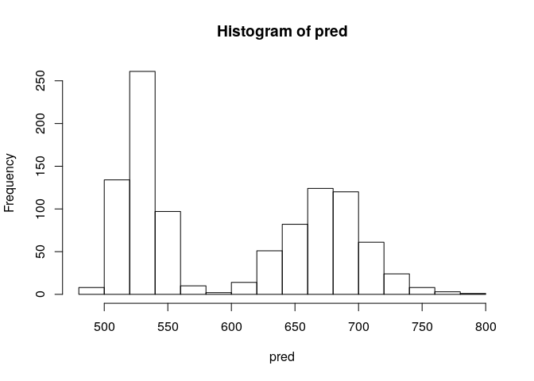

# traveltimeHMM

`traveltimeHMM` package implements a Hidden Markov Model (HMM) with a
random trip effect to estimate the distribution of travel time. The HMM
is used to capture dependency on hidden congestion states. The trip
effect is used to capture dependency on driver behaviour. Variations of
those two types of dependencies leads to four models to estimate the
distribution of travel time. Prediction methods for each model is
provided.

[Package website](https://melmasri.github.io/traveltimeHMM/)

## Installation

The package is still under development in the Beta stage.

aInstall from [GitHub](https://github.com/melmasri/traveltimeHMM) with:

``` r
# install.packages("devtools")
devtools::install_github("melmasri/traveltimeHMM")
#> Downloading GitHub repo melmasri/traveltimeHMM@master
#>   
   checking for file ‘/tmp/RtmpTtyyrN/remotes19b05d3f96c6/melmasri-traveltimeHMM-0a3b67e/DESCRIPTION’ ...
  
✔  checking for file ‘/tmp/RtmpTtyyrN/remotes19b05d3f96c6/melmasri-traveltimeHMM-0a3b67e/DESCRIPTION’
#> 
  
─  preparing ‘traveltimeHMM’:
#>    checking DESCRIPTION meta-information ...
  
✔  checking DESCRIPTION meta-information
#> 
  
─  checking for LF line-endings in source and make files and shell scripts
#> 
  
─  checking for empty or unneeded directories
#> ─  looking to see if a ‘data/datalist’ file should be added
#> 
  
─  building ‘traveltimeHMM_0.900.tar.gz’ (827ms)
#> 
  
   
#> 
#> Installing package into '/tmp/RtmpTtyyrN/temp_libpath19b04e27ffb'
#> (as 'lib' is unspecified)
```

## Example

This package includes a small data set (`tripset`) that aggregates
map-matched anonymized mobile phone GPS data collected in Quebec city in
2014 using the Mon Trajet smartphone application developed by [Brisk
Synergies Inc](https://brisksynergies.com/). The precise duration of the
time period is kept confidential.

View the data with:

``` r
library(traveltimeHMM)
data(tripset)
head(tripset)
#>   tripID linkID timeBin logspeed traveltime    length                time
#> 1   2700  10469 Weekday 1.692292  13.000000  70.61488 2014-04-28 03:07:27
#> 2   2700  10444 Weekday 2.221321  18.927792 174.50487 2014-04-28 03:07:41
#> 3   2700  10460 Weekday 2.203074   8.589937  77.76295 2014-04-28 03:07:58
#> 4   2700  10462 Weekday 1.924290  14.619859 100.15015 2014-04-28 03:08:07
#> 5   2700  10512 Weekday 1.804293   5.071986  30.81574 2014-04-28 03:08:21
#> 6   2700   5890 Weekday 2.376925  31.585355 340.22893 2014-04-28 03:08:26
```

To fit a simple `HMM` model use the following code

``` r
fit <- traveltimeHMM(data = tripset,nQ = 2,max.it = 20, model = "HMM")
#> max.speed is not specified, setting at default value: 130 km/h
#> Model HMM with 4914 trips over 13235 roads and 5 time bins...
#> Expected completion of 20 iterations in 122 secs
#> Reached maximum number of iterations
```

Predict for a single with:

``` r
single_trip <- subset(tripset, tripID==2700)
pred <- predict(object = fit,
               tripdata = single_trip,
               starttime = single_trip$time[1],
               n = 1000)
hist(pred)
```



## Bugs

This is a work in progress. For bugs and features, please refer to
[here](https://github.com/melmasri/traveltimeHMM/issues).
